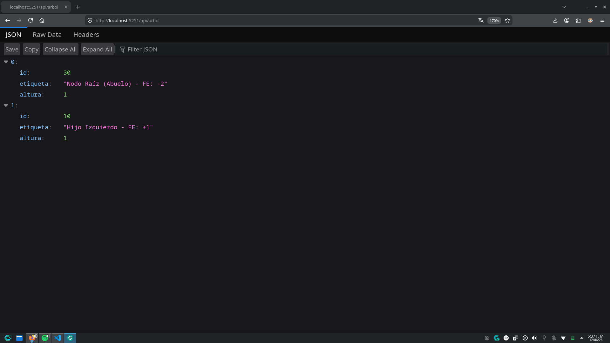
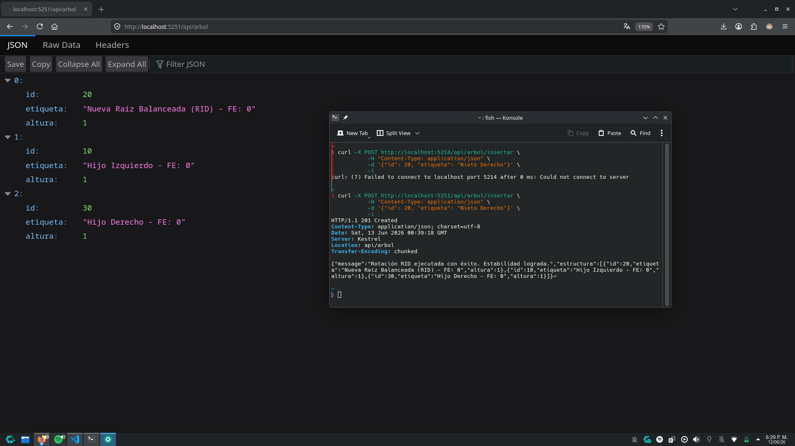

# Actividad de Investigación y Práctica: Balanceo Compuesto en Árboles AVL y Exposición de Estructuras vía Web APIs

## 1. El Límite de las Rotaciones Simples y Desbalanceo en "Zig-Zag"
- **Problema cruzado**: Las rotaciones simples fallan en secuencias cruzadas porque el nodo nieto desbalancea el árbol desde el interior. Al realizar una rotación simple, el nodo desbalanceado se convierte en el nuevo nodo raíz, pero el nodo nieto permanece en su posición original, lo que puede resultar en un árbol aún más desbalanceado.

    - **Definición matemática para una Rotación Doble Izquierda-Derecha (RID)**: Se ejecuta cuando un nodo crítico P (padre) tiene un Factor de Equilibrio (FE) de -2, y su hijo izquierdo H tiene un FE de +1.
        - FE(P) = -2
        - FE(H) = +1

- **Principio DRY (Don't Repeat Yourself)**: La principal ventaja de las rotaciones compuestas es que evitan la necesidad de múltiples rotaciones simples, reduciendo la complejidad y el código repetitivo. 
    - Reutilización de código: Una rotación doble no es más que una combinación de dos rotaciones simples, pero encapsula esta lógica en una sola operación, lo que mejora la legibilidad y mantenibilidad del código.
    - Abstracción: Al reutilizar las funciones de rotación simple ya probadas y validadas, se evita la manipulación manual de punteros desde cero, disminuyendo drásticamente la probabilidad de dejar punteros huérfanos, romper el árbol o generar fugas de memoria

## 2. Fundamentos de Arquitectura Web y Protocolos HTTP

### Modelo Cliente-Servidor

En este modelo interactúan dos componentes principales: el cliente, que solicita servicios o recursos, y el servidor, que procesa estas solicitudes y proporciona las respuestas. Este modelo es fundamental para la arquitectura web, ya que permite la distribución de tareas y recursos entre diferentes sistemas.

**Flujo de los datos**:

- Petición (Request): El cliente envía una solicitud al servidor, que incluye información como la URL, el método HTTP (GET, POST, etc.) y los datos necesarios para procesar la solicitud.

- Respuesta (Response): El servidor procesa la solicitud y devuelve una respuesta al cliente, que incluye un código de estado HTTP (200 OK, 404 Not Found, etc.) y, opcionalmente, un cuerpo de respuesta con los datos solicitados.

### Semántica de Operaciones

La diferencia entre los métodos HTTP es crucial para entender cómo interactúan los clientes y servidores en la web:

| Característica | HTTP GET | HTTP POST |
|----------------|----------|-----------|
| **Propósito** | Diseñado exclusivamente para recuperar u obtener información del servidor. | Diseñado para enviar datos al servidor con el fin de procesarlos o modificarlos. |
| **Envío de datos** | Los datos se envían a través de la URL como parámetros de consulta (query parameters). | Los datos se envían en el cuerpo de la solicitud, lo que permite enviar grandes cantidades de información. |
| **Propiedades** | Es idempotente, lo que significa que múltiples solicitudes idénticas tendrán el mismo efecto que una sola solicitud. | No es idempotente, ya que cada solicitud puede tener un efecto diferente (por ejemplo, crear un nuevo recurso cada vez). |

Para la recuperación de datos, se utiliza el método **HTTP GET**, mientras que para la creación o modificación de recursos se emplea el método **HTTP POST**. Esta distinción es fundamental para diseñar APIs RESTful y garantizar una comunicación clara entre clientes y servidores.

## Implementación Práctica: API de Simulación AVL

     
    Verificación de la existencia del estado inicial desbalanceado en forma de Zig-Zag.

     
    Envío del POST para disparar el balanceo analizado.

