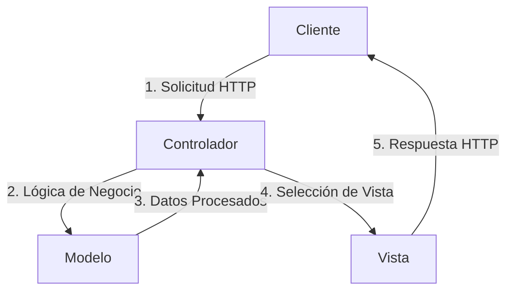
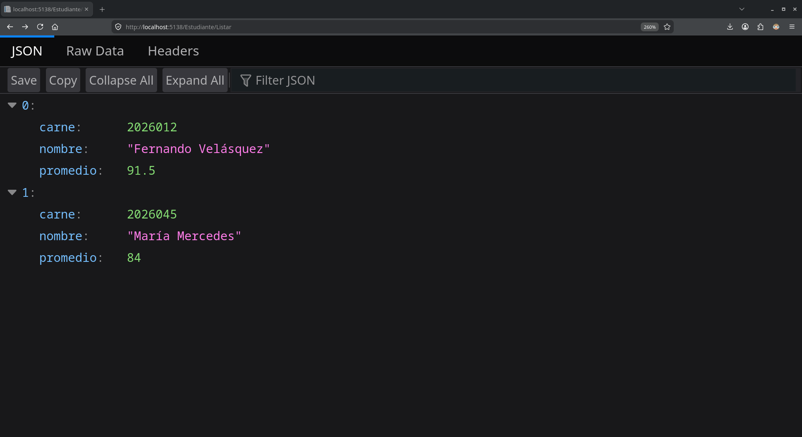
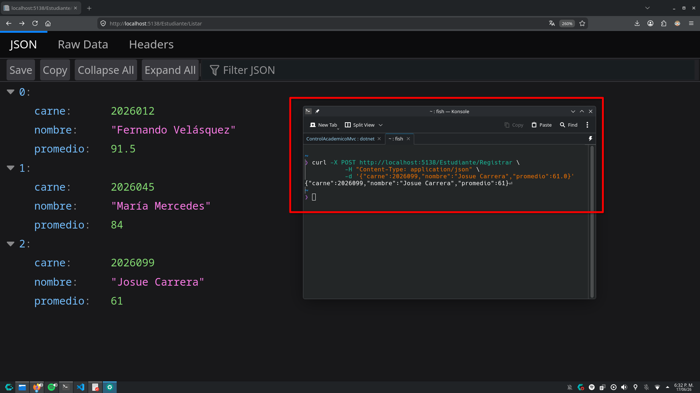

# Actividad de Laboratorio: Arquitectura Multi-Nivel (N-Tier) y Patrón Lógico de Software (MVC) en .NET

## Fundamentación Teórica y Análisis Crítico

### 1. El Tránsito hacia los Sistemas Distribuidos y Multi-Capa

#### La Limitación del Monolito Local:
Cuando la interfaz de usuario (UI), la lógica de negocio y el almacenamiento de datos residen exclusivamente en una única máquina física aislada, el sistema enfrenta graves problemas de sincronización y escalabilidad:

- **Sincronización**: En un monolito local, la UI, la lógica de negocio y el almacenamiento de datos están estrechamente acoplados. Esto significa que cualquier cambio en una parte del sistema puede afectar a las otras partes, lo que dificulta la sincronización de los componentes. Además, si la máquina experimenta fallos o interrupciones, todo el sistema se ve afectado, lo que puede resultar en pérdida de datos o interrupciones en el servicio.

- **Escalabilidad**: Un monolito local no puede escalar horizontalmente (agregar más máquinas) sin una reestructuración significativa. Esto limita la capacidad de manejar un aumento en la carga de trabajo, ya que todo el procesamiento y almacenamiento se concentra en una sola máquina.

#### Distinción Crítica (Layers vs. Tiers):

- **Layers (Capas)**: Se refiere a la organización lógica del código dentro de una aplicación. Por ejemplo, en una arquitectura de tres capas, podríamos tener una capa de presentación (UI), una capa de lógica de negocio y una capa de acceso a datos. Estas capas pueden residir en la misma máquina física. Todas las capas pueden compilarse y ejecutarse en un solo entorno, lo que no necesariamente implica una distribución física. Su objetivo principal es la separación de responsabilidades y la modularidad del código.

- **Tiers (Niveles)**: Se refiere a la distribución física de los componentes de una aplicación en diferentes máquinas o servidores. En una arquitectura de tres niveles, la capa de presentación podría residir en un servidor web, la capa de lógica de negocio en un servidor de aplicaciones y la capa de acceso a datos en un servidor de base de datos. Esta distribución permite una mayor escalabilidad y flexibilidad, ya que cada nivel puede ser escalado independientemente según las necesidades del sistema.

#### Responsabilidades en la Arquitectura de 3 Niveles:

- **Nivel 1: Capa de Presentación (UI)**: Es responsable de interactuar con el usuario, capturar sus entradas y mostrar los resultados. Esta capa se encarga de la experiencia del usuario y puede incluir tecnologías como HTML, CSS, JavaScript, o frameworks como ASP.NET MVC.

- **Nivel 2: Capa de Lógica de Negocio**: Es responsable de procesar la lógica de negocio, realizar cálculos, validar datos y tomar decisiones basadas en las reglas del negocio. Esta capa actúa como intermediaria entre la capa de presentación y la capa de acceso a datos, asegurando que las operaciones se realicen correctamente.

- **Nivel 3: Capa de Acceso a Datos**: Es responsable de interactuar con la base de datos, realizar consultas, insertar, actualizar y eliminar datos. Esta capa abstrae la complejidad de la base de datos y proporciona una interfaz para que la capa de lógica de negocio pueda acceder a los datos sin preocuparse por los detalles de implementación.

#### Seguridad Perimetral:
Desde el punto de vista de la ingeniería de seguridad, exponer públicamente el puerto de una base de datos a Internet es un error crítico por las siguientes razones:

- **Superficie de ataque**: Exponer el puerto de la base de datos aumenta significativamente la superficie de ataque, ya que los atacantes pueden intentar explotar vulnerabilidades en el software de la base de datos o realizar ataques de fuerza bruta para obtener acceso no autorizado.

- **Falta de capas de defensa**: Al exponer directamente la base de datos, se omiten las capas de defensa que podrían estar presentes en una arquitectura de múltiples niveles, como firewalls, sistemas de detección de intrusiones y autenticación robusta.

**Buenas prácticas para su protección:**

- **Aislamiento en Redes Privadas**: Mantener la base de datos en una red privada, accesible solo desde la capa de lógica de negocio, y no directamente desde Internet.

- **Principio de Privilegio Mínimo mediante Firewalls/Security Groups**: Se deben configurar reglas de firewall estrictas para que la base de datos solo acepte tráfico entrante proveniente de las direcciones IP específicas o contenedores que pertenecen al Nivel 2 (Application Tier).

- **Uso de Bastion Hosts / VPNs**: Si un administrador humano necesita acceder a la base de datos para mantenimiento, debe hacerlo obligatoriamente a través de una red privada virtual (VPN) corporativa o un servidor puente altamente protegido (Bastion Host o Jumpbox).

### 2. Desacoplamiento Lógico con el Patrón MVC

#### La Crisis del Código Espagueti:
Mezclar sentencias SQL (persistencia), lógica matemática/de negocio y etiquetas visuales (HTML/CSS) dentro de un mismo archivo físico genera impactos drásticamente negativos en el ciclo de vida del software:

- **Impacto en el Mantenimiento**: El código se vuelve sumamente rígido y frágil. Si se requiere realizar un cambio estético en la interfaz, se corre el riesgo de alterar accidentalmente la lógica matemática o romper una consulta a la base de datos. Además, la legibilidad disminuye de forma exponencial, lo que incrementa el tiempo que los desarrolladores necesitan para comprender el archivo y multiplica la aparición de errores (bugs).

- **Impacto en el Diseño de Pruebas Unitarias**: Es prácticamente imposible diseñar pruebas unitarias eficientes en este escenario. Para probar un cálculo matemático aislado, se tendría que simular toda la conexión a la base de datos y el renderizado de la interfaz gráfica. Al no poder aislar las funciones, las pruebas automatizadas se vuelven complejas, lentas y costosas de implementar.

#### Separación de Preocupaciones (SoC):
Este principio establece que el software debe dividirse en secciones diferenciadas, donde cada una aborde una responsabilidad o "preocupación" única. En el patrón formulado originalmente por Trygve Reenskaug, el aislamiento se define de la siguiente manera:

- **Modelo**: Representa los datos del sistema, el estado de la aplicación y las reglas de negocio que los gobiernan (validaciones, cálculos, lógica de persistencia). Por qué no debe conocer cómo se muestran los datos: El Modelo debe ser completamente independiente de la representación visual. Esto permite que los mismos datos y lógica puedan ser reutilizados por múltiples interfaces diferentes (por ejemplo, una vista web en HTML, una aplicación móvil o una API JSON) sin necesidad de modificar una sola línea de código del Modelo.

- **Vista**: Se define como una entidad pasiva e inteligente. Es pasiva porque no toma decisiones ni inicia flujos de lógica por sí misma; simplemente espera a que se le entreguen los datos para renderizarlos. Es inteligente porque sabe exactamente de qué manera formatear y presentar visualmente esos datos específicos al usuario final. Tiene estrictamente prohibido contener código de acceso a bases de datos o lógica de negocio compleja; solo debe contener código de presentación.

- **Controlador**: Su rol es el de un intermediario en la red. Es el encargado de recibir las peticiones o eventos del usuario (a través de la Vista o rutas de red), interpretar la intención de la solicitud, invocar los métodos correspondientes del Modelo para procesar la información y, finalmente, seleccionar la Vista adecuada que debe mostrar el resultado al usuario.

#### Métricas de Ingeniería de Software:
El patrón MVC es una herramienta fundamental en entornos profesionales porque impacta directamente de forma positiva en dos métricas clave:

- **Alta Cohesión**: Cada componente del patrón (M, V o C) tiene una tarea única, clara y muy bien delimitada. El código relacionado con una función específica no se dispersa, lo que facilita enormemente su comprensión, depuración, especialización de los desarrolladores y evolución a largo plazo.

- **Bajo Acoplamiento**: Al establecer interfaces de comunicación claras e independientes entre los tres componentes, los cambios internos en uno de ellos no repercuten ni rompen el funcionamiento de los demás. Por ejemplo, es posible rediseñar la base de datos por completo (capa del Modelo) sin alterar en absoluto el diseño visual de la aplicación (capa de la Vista).

## Modelado del Ciclo de Vida y Enrutamiento Semántico

### 1. Mapeo Analítico de URLs

| URL Entrante del Cliente | Clase Controladora Buscada por el Framework | Método (Acción) Ejecutado | Parámetro ID Inyectado |
| :-------------------------: | :-----------------------------------------: | :----------------------: | :--------------------: |
| https://ingenieria.usac.edu.gt/ControlAcademico/Login | ControlAcademicoController | Login | (Ninguno - Opcional) |
| https://ingenieria.usac.edu.gt/Estudiante/Historial/20260123 | EstudianteController | Historial | 20260123 |
| https://ingenieria.usac.edu.gt/Asignacion/Detalle/10 | AsignacionController | Detalle | 10 |
| https://ingenieria.usac.edu.gt/Home | HomeController | Index | (Ninguno - Opcional) |

### 2. Diagramación del Flujo Interactivo

#### Descripción del Flujo:

1. **Origen**: El cliente (navegador web) envía una solicitud HTTP a una URL específica.
2. **Intercepción**: El framework de MVC intercepta la solicitud y la dirige al controlador correspondiente basado en el enrutamiento definido.
3. **Procesamiento**: El controlador procesa la solicitud, interactúa con el modelo para ejecutar la lógica de negocio y obtener los datos necesarios.
4. **Selección de Vista**: Una vez que el controlador recibe los datos procesados del modelo, selecciona la vista adecuada para renderizar la respuesta.
5. **Respuesta**: La vista genera el contenido HTML y lo envía de vuelta al cliente como respuesta HTTP.

## Implementación Práctica - Sistema de Control Académico

## Auditoría y Control de Calidad

### 1. Prueba de Cohesión (Petición GET)
* **Resultado del endpoint:** Al acceder mediante el navegador, el framework procesó la solicitud de manera exitosa, retornando los datos de la colección en memoria centralizada en un formato JSON limpio.

* **Evaluación de Cohesión:** Se constató que la respuesta es completamente limpia. El controlador cumple de forma estricta con una **Alta Cohesión**, limitándose exclusivamente a actuar como despachador perimetral de la información hacia el cliente. No realiza cálculos de variables internas de negocio ni expone acoplamiento físico mediante sentencias SQL en texto plano.

   
  Figura 1: Respuesta JSON Limpia desde el Controlador

### 2. Evaluación de Antipatrones (Análisis de Estructura)

* **Métrica de Líneas de Código:** Se realizó una auditoría sobre el archivo físico `EstudianteController.cs` con el fin de cuantificar la densidad de sus métodos.
    * El método `Listar()` ocupa 4 líneas de código eficaz.
    * El método `Registrar()` ocupa 9 líneas de código eficaz.

* **Diagnóstico**: Ambos métodos se sitúan muy por debajo del límite estricto de 20 líneas de código definido en las reglas de diseño del laboratorio. Por consiguiente, el proyecto implementa exitosamente la técnica de **Controladores Delgados (Skinny Controllers)**, mitigando por completo el antipatrón de diseño de software conocido como **Controladores Gordos (Fat Controllers)**.

   
  Figura 2: Registro de Estudiante

## Referencias Bibliográficas

- **Tanenbaum, A. S., & Van Steen, M. (2017).** Distributed Systems: Principles and Paradigms.

- **Reenskaug, T. (1979).** THING-LAB-An Object-Oriented System for Building Interactive Computer Programs. Xerox PARC.

- **Gamma, E., Helm, R., Johnson, R., & Vlissides, J. (1994).** Design Patterns: Elements of Reusable Object-Oriented Software. Addison-Wesley.

- **Martin, R. C. (2017).** Clean Architecture: A Craftsman's Guide to Software Structure and Design. Prentice Hall.

- **Cheswick, W. R., Bellovin, S. M., & Rubin, A. D. (2003).** Firewalls and Internet Security: Repelling the Wily Hacker. Addison-Wesley Professional.